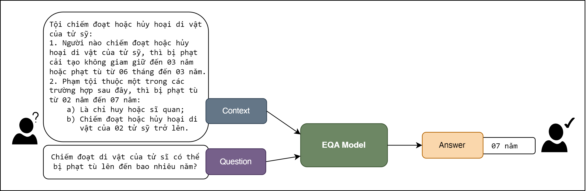

# ViLQA: Vietnamese Legal Question Answering

## Introduction

**ViLQA** is a project focused on fine-tuning Question Answering models for Vietnamese legal text. This project aims to enhance the performance of models in answering questions based on Vietnamese legal documents, particularly on extractive question answering datasets.

## What is Extractive Question Answering?

Extractive Question Answering (EQA) is a Natural Language Processing task where the model is given a question and a context (usually a paragraph or a document) and must extract the answer directly from the context. The key assumption in EQA is that the answer is a continuous span of text within the given context.

Here's an example of Extractive Question Answering:

<figure>
  <p align="center">
    
  </p>
  <p align="center"><normal>Fig.1: An example of Extractive Question Answering</strong></p>
</figure>

In this example:
- Context: The legal text about the crime of appropriating or destroying relics of fallen soldiers
- Question: "Chiếm đoạt di vật của tử sĩ có thể bị phạt tù lên đến bao nhiêu năm?" (How many years of imprisonment can one face for appropriating relics of fallen soldiers?)
- Answer: "07 năm" (07 years)

The model must extract the correct answer span from the given context based on the question.

## Key Features

- Fine-tuning Question Answering models on the Vietnamese Extractive Question Answering dataset.
- Support for advanced language models (BERT, PhoBERT, XLM_RoBERTa...).
- Easy integration with popular tools and libraries.
- Customizable parameters for difference purposes.

## Project Structure

This project implements the MRC approach to Extractive Question Answering:

1. **MRC (Machine Reading Comprehension)**: This approach extracts the answer (span text) directly from the given context.
The code for the MRC approach is organized in a separate directory (`MRC/`) for clarity and maintainability.

```plaintext
  MRC/
   ├── config.py                 # Project configuration file
   ├── train.py                  # Main script for fine-tuning
   ├── requirements.txt          # List of required Python libraries
   ├── data/
   │   ├── __init__.py           # Init module for data
   │   ├── data_processing.py    # Data processing script
   │   └── dataset/
   │       └── ALQAC.csv         # Vietnamese dataset for QA
   ├── models/
   │   ├── __init__.py           # Init module for models
   │   └── eqa_model.py          # Model for Extractive Question Answering
   └── utils/
       ├── __init__.py           # Init module for utils
       └── metrics.py            # Script for calculating model metrics
```

## System Requirements

- Python 3.7 or higher
- Python libraries listed in requirements.txt

## Problem Formulation Machine Reading Comprehension (MRC)

Given:
- A context C = [c1, c2, ..., cn], where ci are tokens in the context
- A question Q = [q1, q2, ..., qm], where qi are tokens in the question

The goal is to find:
- Start index s and end index e in C, so the span [cs, cs+1, ..., ce] answers the question Q.


## Installation Guide

### I. Clone the repository:

```python
git clone https://github.com/Sup3r-H4ck3r/ViLQA.git
```

### II. Choose the approach to EQA
#### 2.1. With MRC approach

```python
cd ViLQA/EQA
```

#### 2.2 Create a virtual environment (recommended):

```python
python3 -m venv venv
source venv/bin/activate
```

#### 2.3. Install the dependencies:

```python
pip install -r requirements.txt
```

## Usage Instructions
### With MRC approach
#### 1. Configure the project:

Update the parameters in config.py to suit your dataset and requirements.

#### 2. Fine-tune and evaluate the model:

Run the following command to start fine-tuning and evaluate the model:

```python
python train.py
```

## Contribution

We welcome contributions to this project. Please create a pull request or open an issue to discuss your ideas for improvement.

## License
This project is licensed under the MIT License. See the LICENSE file for details.
